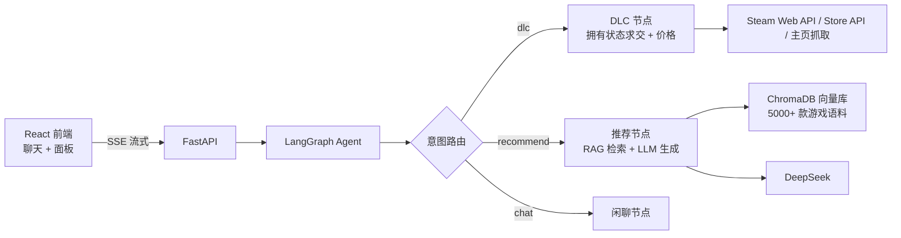

# SteamAssistant 🎮

AI 游戏助手 Agent

读取你的 Steam 游戏库,整理已拥有游戏的 DLC 信息,并根据你的游戏库做定制化游戏推荐(基于 RAG 语义检索)。

## 技术栈

| 层 | 技术 |
|---|---|
| 前端 | React + Vite + TypeScript |
| 后端 | FastAPI |
| Agent | LangGraph(意图路由 → DLC / 推荐 / 闲聊) |
| RAG | ChromaDB + sentence-transformers(本地 embedding) |
| LLM | DeepSeek(`deepseek-flash`) |

## 架构



## 目录结构

```
SteamAssistant/
├─ frontend/          # React + Vite
│  └─ src/components/ # Chat / Library / Dlc / Recommend
├─ backend/
│  ├─ app/
│  │  ├─ main.py      # FastAPI 入口 + CORS
│  │  ├─ routers/     # library / dlc / recommend / chat(SSE)
│  │  ├─ agent/       # LangGraph 图、提示词、流式
│  │  ├─ rag/         # embedder + ChromaDB 检索
│  │  └─ steam/       # API 客户端、导入、DLC 计算
│  ├─ scripts/        # build_corpus.py / build_index.py
│  ├─ data/           # 语料 + 向量库(已 gitignore,需本地构建)
│  └─ .env.example
└─ PLAN.md
```

## 快速开始

### 0. 准备

- Python 3.11+、Node.js 20+
- 申请 [DeepSeek API key](https://platform.deepseek.com)
- 申请 [Steamworks Web API key](https://steamcommunity.com/dev/apikey)(登录后填域名如 `localhost` 即可)
- Steam 设置 → 隐私 → 「游戏详情」设为**公开**(否则读不到库)

### 1. 后端

```bash
cd backend
python -m venv .venv
# Windows: .venv\Scripts\activate   macOS/Linux: source .venv/bin/activate
pip install -r requirements.txt        # 慢的话加 -i https://pypi.tuna.tsinghua.edu.cn/simple
cp .env.example .env                   # 填入真实 key
```

编辑 `backend/.env`:

```env
DEEPSEEK_API_KEY=sk-xxxx
STEAM_API_KEY=xxxx
STEAM_ID=7656119xxxxxxxxxx            # 可选
STEAM_PROXY=http://127.0.0.1:12450    # 国内访问 Steam 的本地代理,无则留空
HF_ENDPOINT=https://hf-mirror.com     # 国内下载模型/数据集镜像
```

构建 RAG 语料与向量索引(一次性,约几分钟):

```bash
python scripts/build_corpus.py   # 下载数据集(192MB) -> data/corpus.jsonl(5362 条)
python scripts/build_index.py    # 嵌入 -> data/chroma
```

启动:

```bash
uvicorn app.main:app --reload
# Swagger: http://127.0.0.1:8000/docs
```

### 2. 前端

```bash
cd frontend
npm run dev
# http://localhost:5173 (已配置 /api 代理到 8000)
```

## 功能说明

- **游戏库导入**:SteamID 导入(需 key + 资料公开),内置获取 SteamID 引导弹窗
- **DLC 整理**:列出每款游戏的已拥有 / 未拥有 DLC 与价格,汇总补齐总价
- **游戏推荐**:从你的库中提取类型画像 → 语义检索相似游戏 → LLM 生成个性化推荐 + 理由
- **流式输出**:聊天中实时展示 agent 中间步骤(route/dlc/recommend)与 token 流

## 注意事项

- `backend/data/`(语料与向量库)已 gitignore,clone 后需重新 `build_corpus.py` + `build_index.py`
- 首次「推荐游戏」请求会加载本地 embedding 模型(约 10~20s),之后走缓存很快
